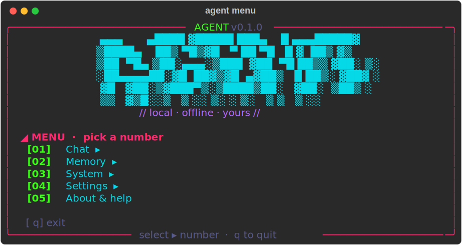

<div align="center">

# 🜁 agent

**A fully-local AI agent for your terminal.**

Runs entirely on your own machine against [Ollama](https://ollama.com) — no
account, no cloud, no telemetry. It remembers your conversations, can use your
PC behind a safety gate, and searches the live web when you ask it to.

[](https://github.com/ilvy23/local-ai-agent/actions/workflows/ci.yml)


<br>


<sub><i>A live <code>/web</code> search — the agent visits the sources and answers with citations.</i></sub>

</div>

---

## Why

Most AI assistants send everything you type to someone else's servers. agent
doesn't. It's a small, hackable CLI that keeps your data in one SQLite file on
your disk and talks only to a model running on your own hardware — with one
exception you control: an explicit web search.

## Features

- 🧠 **Persistent memory** — every chat is saved and resumable, and durable facts
  about you are distilled automatically and recalled semantically.
- 🌐 **Live web search** — end any message with `/web` and it searches the
  internet, shows each site as it visits it, and answers with cited sources.
- 🖥️ **Uses your PC** — runs shell commands and reads/writes files through a
  risk-classified safety gate: safe commands run, risky ones ask, dangerous ones
  are blocked. Everything is logged to an audit trail.
- 🎛️ **Interactive menu** — a friendly launcher over every command (`agent menu`).
- 📊 **Live status panel** — machine, Ollama, and data at a glance.
- 🎮 **Game-aware** — background work pauses while you're gaming so it never steals
  your GPU.
- 🔒 **Yours** — one local SQLite database. Delete it and it's gone.

## Install

### Linux — Ubuntu/Debian, Arch, Fedora, openSUSE

```bash
./install.sh
```

### Windows *(experimental — not yet verified on a real machine)*

```powershell
powershell -ExecutionPolicy Bypass -File .\install.ps1
```

The installer sets up [uv](https://docs.astral.sh/uv/) (which fetches the right
Python), installs dependencies, ensures Ollama is running, and pulls the default
models (~6 GB, one time). It's idempotent — safe to re-run.

<details>
<summary><b>Manual install</b> (if you already have uv + Ollama)</summary>

```bash
uv sync
ollama pull dolphin3:8b bge-m3
```
</details>

## Usage

```bash
uv run agent menu     # interactive menu — start here
uv run agent chat     # jump straight into a chat
```

<div align="center"></div>

Inside a chat:

```
you> what changed in the latest python release /web
```

The `/web` suffix forces a live web search for that message; the agent also
searches on its own when a question needs current information.

<details>
<summary><b>All commands</b></summary>

```
agent chat              # start a new chat session
agent resume [id]       # resume the most recent (or a given) session
agent sessions          # list past sessions
agent menu              # interactive menu over all commands
agent memory list       # list remembered facts
agent memory search Q   # search facts (semantic, falls back to substring)
agent memory add TEXT   # manually add a fact
agent memory forget ID  # forget a fact by id
agent memory prune      # drop junk facts (paths, tool output, timestamps)
agent audit             # view the tool/command audit log
agent panel             # live status panel (machine, Ollama, data)
agent settings show     # view settings
agent reembed MODEL     # switch the embedding model + rebuild the index
```
</details>

## Configuration

Defaults live in `config.yaml` (created on first run). Models are editable there
or via `agent settings set`:

| Setting | Default | Purpose |
|---|---|---|
| `models.chat` | `dolphin3:8b` | interactive chat + tools |
| `models.background` | `dolphin3:8b` | fact distillation |
| `models.embed` | `bge-m3` | embeddings (multilingual, 1024-dim) |

Swap the embedding model any time with `agent reembed <model>` — it rebuilds
the semantic index at the new dimension.

## How it works

- **One SQLite database** (`data/agent.db`) holds sessions, messages, facts,
  the vector index (via [sqlite-vec](https://github.com/asg017/sqlite-vec)), and
  the audit log.
- **Memory** is three layers: the full conversation log, distilled facts about
  you, and semantic recall over both. Context for each reply = persona + relevant
  facts + recalled memories + the current session.
- **Tools** are gated by a risk classifier before they run; every execution is
  audited.

## Privacy

Everything stays on your disk and talks only to your local Ollama instance. The
one time data leaves your machine is a web search you explicitly trigger — and it
shows you exactly which sites it visits.

## Development

```bash
uv run pytest          # run the test suite
```

## License

[MIT](LICENSE).
