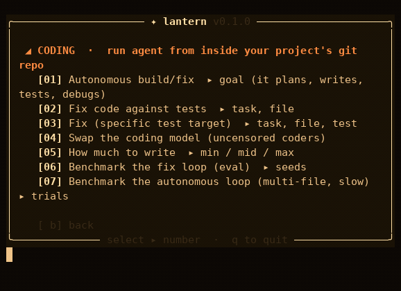

<div align="center">

# lantern

**A local AI agent that lives in your terminal.**

It chats, remembers, searches the web, and writes code — all against your own
[Ollama](https://ollama.com). No account, no API key, nothing phoning home.

[](https://github.com/ilvy23/local-ai-agent/actions/workflows/ci.yml)


<br>


<sub><i>It lights up like a lantern — a warm little AI that lives in your terminal.</i></sub>

</div>

---

## Why this exists

I wanted an assistant I could talk to without shipping my life to someone
else's servers. Everything here stays in one SQLite file on my disk, and the
only time anything touches the network is a web search I explicitly ask for.

It's also just a small, readable codebase. If you want to change how it thinks,
the whole thing fits in your head.

## What it does

**Remembers you.** Chats are saved and resumable. It quietly pulls durable facts
out of conversations and recalls them later by meaning, not keyword. (It used to
remember all sorts of junk. That took a while to fix.)

**Writes and fixes code.** Give it a goal — `lantern code "build a CLI word-counter
with tests"` — and it writes the files, runs them in a throwaway git worktree, and
loops until the tests pass. You watch it type in real time. Point it at a failing
test instead (`-f`) and it debugs the code. It can't fake success: every change
runs a real ladder (syntax → lint → tests), it isn't allowed to edit the tests to
cheat, and a reviewer pass rejects gamed diffs. Honest limit — a 7B is genuinely
good at focused builds and fixes; a whole complex app in one shot is past its edge,
so swap in a bigger model (`lantern code-model`) when you want more.

**Searches the web when you ask.** Put `/web` at the end of a message and it goes
and looks. You watch it visit each site in real time, and it answers with the
sources. No API key — it scrapes DuckDuckGo.

**Sharpens & anonymises your prompts.** A local prompt studio (`lantern prompt`):
**improve** a rough prompt, turn it into a full structured **plan** prompt, or
**anonymise** it so it gives nothing away about you. Work one-shot, or in a saved,
resumable chat (people rarely one-shot a prompt). The anonymiser has four
strengths — the same idea, dialled up:

| mode | a revealing prompt… | becomes |
|---|---|---|
| **light** | *"I'm Sarah Chen, a nurse at Boston General — a spreadsheet to track my patients' meds on my night shifts"* | "A spreadsheet to track patients' medication schedules for night-shift duties." |
| **heavy** | *"remind my mom Rosa in Lisbon to take her pills; I live in Berlin and worry"* | "A reminder app for a small team to help users manage medication schedules; test it locally first." |
| **poison** | *"watch my competitor TechFlow's pricing, email john@mystartup.io so my startup can undercut them"* | "A script to monitor price changes in our industry and email general-team@ourcompany.com — real-time pricing to stay competitive." |
| **max** | *"I'm Daniel, an accountant in Chicago — track what my wife Emma and I spend, I'm secretly saving for a surprise trip to Japan"* | *5 passes — distil the core, then rebuild it in a new domain →* a complete **"Expense Manager for Small Businesses"** spec. |

*light* keeps the domain and de-names it; *heavy* genericises it; *poison* adds a
plausible cover story; *max* distils to the essential capability and rebuilds it,
unrecognisable, in a different domain — while keeping the real requirements.

**Uses your computer.** It can run shell commands and read or write files. Safe
stuff runs, anything risky asks first, and genuinely dangerous things are refused
outright. Every single thing it runs is written to an audit log you can read.

**Gets out of the way when you game.** Background work checks the GPU and pauses
if you're playing something.

There's an interactive menu (`lantern menu`) if you don't want to memorise
commands, and a live status panel for the machine and models.

## Install

**Linux** (Ubuntu/Debian, Arch, Fedora, openSUSE):

```bash
./install.sh
```

**Windows** — there's an `install.ps1`, but I don't have a Windows machine to
test it on, so treat it as experimental:

```powershell
powershell -ExecutionPolicy Bypass -File .\install.ps1
```

The script walks you through it: checks your system, sets up
[uv](https://docs.astral.sh/uv/) and the dependencies, then offers to install
[Ollama](https://ollama.com) if you don't have it and pulls the two models it
needs (~6 GB, once). It asks before downloading anything and only does what's
missing, so running it twice is harmless. Add `--yes` (or `-Yes` on Windows) to
skip the questions.

<details>
<summary>Already have uv and Ollama?</summary>

```bash
uv sync
ollama pull qwen2.5:7b bge-m3
ollama pull huihui_ai/qwen2.5-coder-abliterate:7b   # for `lantern code`
```
</details>

## Using it

```bash
uv run lantern menu     # if you'd rather click through things
uv run lantern chat     # if you know what you want
```

<div align="center">

<br><sub><i>A quick tour: the menu, the coding tools, chat, and what it is — all warm candlelight on black.</i></sub>
</div>

In a chat, tack `/web` onto anything that needs current information:

```
you> what changed in the latest python release /web
```

It'll also decide to search on its own sometimes, though smaller models are
hit-and-miss about that, which is exactly why `/web` exists.

<details>
<summary>Every command</summary>

```
lantern chat              # new chat
lantern resume [id]       # pick up the last one, or a specific one
lantern sessions          # what you've talked about
lantern menu              # the menu
lantern code "GOAL"       # write a small program + tests, from scratch
lantern code "FIX" -f F   # debug an existing file against its tests
lantern code-model        # show / swap the coding model
lantern code-eval         # benchmark the coding loops on held-out tests
lantern memory list       # what it thinks it knows about you
lantern memory search Q   # semantic, falls back to substring
lantern memory add TEXT   # tell it something directly
lantern memory forget ID  # take it back
lantern memory prune      # bin the junk facts it scraped from tool output
lantern audit             # everything it has run
lantern panel             # live machine + Ollama status
lantern settings show     # current config
lantern reembed MODEL     # change embedding model, rebuild the index
```
</details>

## Config

`config.yaml` shows up on first run. Change models there, or with
`lantern settings set`.

| Setting | Default | What it's for |
|---|---|---|
| `models.chat` | `qwen2.5:7b` | chatting and tool use |
| `models.background` | `qwen2.5:7b` | pulling facts out of conversations |
| `models.embed` | `bge-m3` | embeddings, multilingual, 1024-dim |
| `coding.executor.model` | `qwen2.5-coder-abliterate:7b` | the model behind `lantern code` (swap with `lantern code-model`) |

**The chat model has to support tool calling** (`ollama show <model>` should list
`tools` under capabilities). Ollama silently ignores tools for models that don't,
and then the model will happily *invent* a directory listing rather than admit it
can't read one. `qwen2.5:7b` and `llama3.1:8b` both work; `dolphin3` and `gemma2`
don't. It warns you at startup if you pick one that can't.

Otherwise any Ollama model works. If you swap the embedding model, run
`lantern reembed <model>` and it rebuilds the index at the new size.

## How it fits together

Everything lives in one SQLite file: sessions, messages, facts, the vector index
([sqlite-vec](https://github.com/asg017/sqlite-vec)), and the audit log.

Memory is three layers stacked on each other — the raw conversation log, the
facts distilled out of it, and semantic search across both. What the model sees
each turn is the persona, plus whatever facts and past messages are actually
relevant, plus the current conversation.

Tools go through a risk classifier before they're allowed to run.

## A few honest caveats

- Small local models are not GPT-5. An 8B is fine for chat and decent at
  summarising a web page, but it will occasionally say something confidently
  wrong. The `/web` sources are there so you can check it.
- The coding agent is only as smart as the model behind it. A 7B nails focused
  builds and "fix this failing test," but a large, fully-tested app in one go is
  beyond it — that's the model, not the harness (which keeps every failure
  visible and refuses to fake a pass). A bigger model raises the ceiling.
- Some sites block scrapers. Those show up as `unreachable` and it falls back to
  the search snippet.
- The Windows installer is untested. If you run it, I'd like to hear what broke.

## Ideas are very welcome

Genuinely — if you've got an idea for this, I want to hear it. Half-formed is
fine, "wouldn't it be cool if" is fine, "this annoyed me" is especially fine.

- **[Discussions](https://github.com/ilvy23/local-ai-agent/discussions)** — ideas,
  questions, what you're using it for, models you'd pair it with. No format, just
  say the thing.
- **[Issues](https://github.com/ilvy23/local-ai-agent/issues)** — something's
  broken, or a concrete feature request.

You don't need to write code to be useful here. Telling me what's confusing or
what you wanted it to do is worth a lot.

## Contributing

PRs welcome too, see [CONTRIBUTING.md](CONTRIBUTING.md). Tests run without
Ollama:

```bash
uv run pytest
```

## License

[MIT](LICENSE). Do what you like with it.
